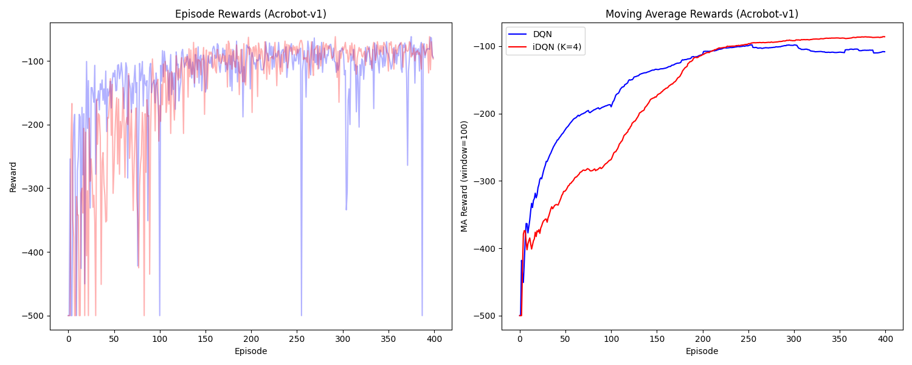

# Implementation of `iterated Deep Q-Network (i-DQN)` in PyTorch

TMLR paper 👉[📄](https://arxiv.org/pdf/2403.02107)

Official implementation in JAX 👉[💻](https://github.com/theovincent/i-DQN)

## User installation
We recommend using Python 3.11.5. In the folder where the code is, create a Python virtual environment, activate it, update pip and install the package and its dependencies in editable mode:
```bash
python3 -m venv env
source env/bin/activate
pip install --upgrade pip
pip install -r requirements.txt
```

## Performances
Run following lines (<20 minutes each)
```bash
python main.py --env Acrobot-v1
python main.py --env CartPole-v1
python main.py --env LunarLander-v3
```
to generate:
<p align="center">
  
  
  
</p>